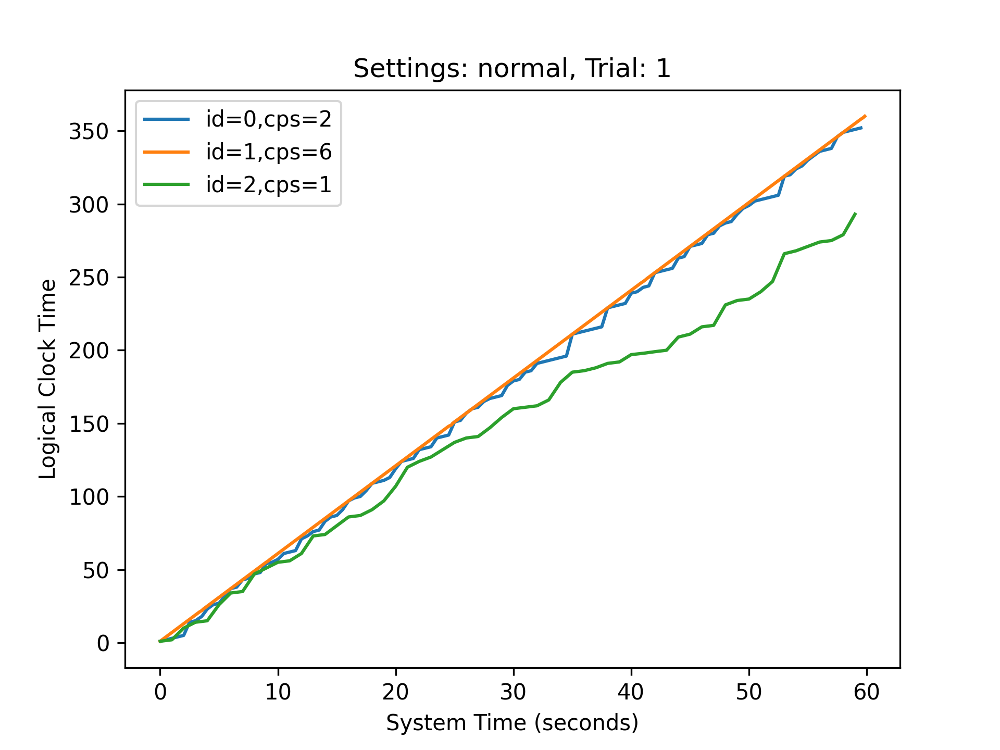
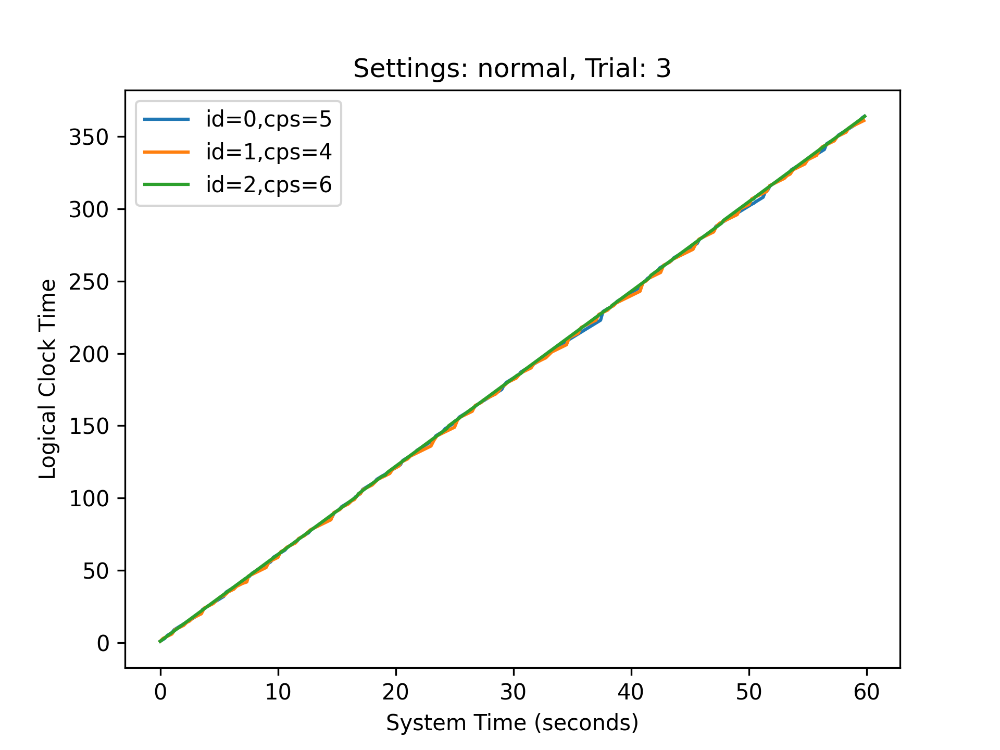
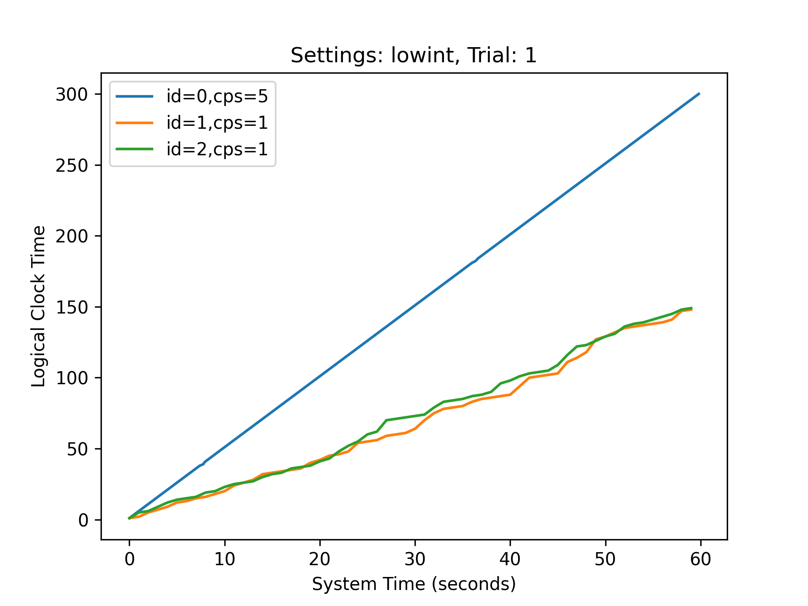
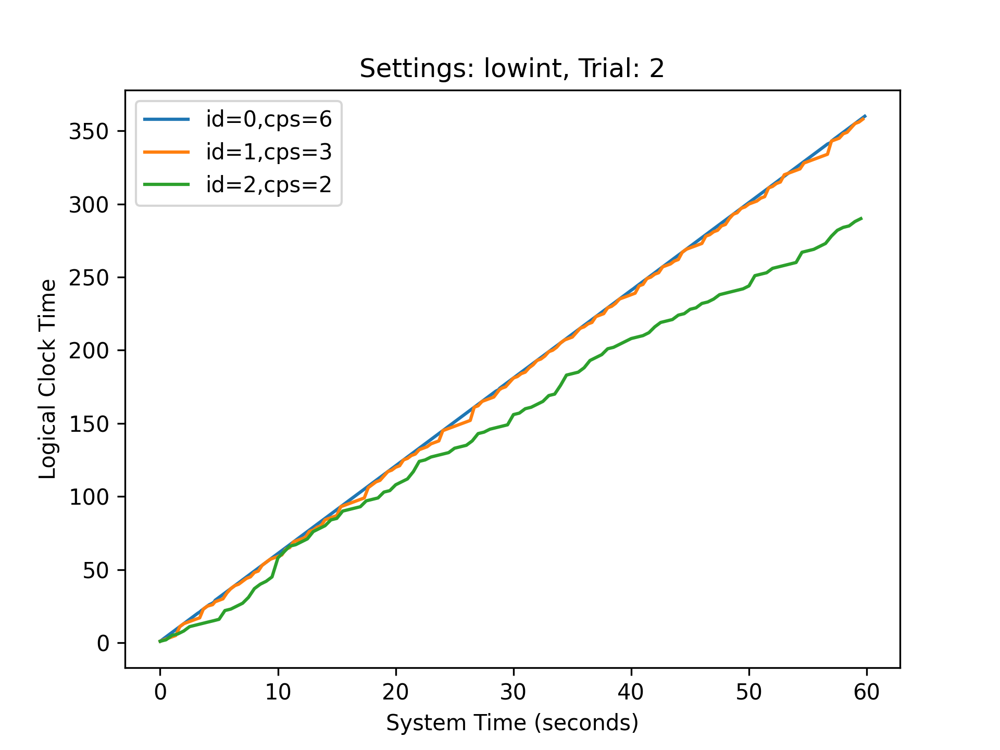

# 2620-logical-clocks

## Code Design

We started "coding" in a Google Doc: the contents of the Google Doc can be viewed [here](https://docs.google.com/document/d/1kHFJNkXWfRq8KOskfWpWH1U9MEDAFvItkBd7kF9diP0/edit?usp=sharing), but we also copied the contents of the document below so the core components of our code design can be viewed. Note that this does not include data collection or graphing - those will be described in later sections

- client.py, server.py
- server.py: call+response protocol that implements queue
    - “login x”: login as machine x where x = 0,1,2
        - response: “success” or “failure”
    - “send y msg”: send msg to machine y (y=0,1,2)
        - response: “success” or “failure”
    - “size”: get size of message queue
        - response: “{sz}” or “error”
    - “pop”: pop a message off of the queue
        - response: “{msg}” or “error”
    - Store for each of the three machines the message queue (array of strings), and for each socket store data of which machine it is
    - Note: since this is for experimental purpose and not for actual use, I suspect we can simply put 127.0.0.1 and port 5544 in the code itself (and should comment as such so the grader knows this is an intentional decision)
- client.py
    - Command line argument: machine id, filename
    - Initialize socket, query “login {id}”
    - Initialize cycles_per_sec (1 to 6), log_clock (0)
    - Open log_{id}.txt file
    - Repeat 60 * cycles_per_sec times:
        - Query “size” -> queue_len
        - If there’s a message:
            - Query “pop”
            - log_clock = max(log_clock, msg) + 1
            - Write to log: “receive {global time} {queue_len} {log_clock}”
        - Else:
            - op = roll random num
            - If 1 <= op <= 3: deal with sends
                - log_clock += 1
                - If op & 1: (bitwise and)
                    - Query: “send {(id+1)%3} {log_clock}”
                - If op & 2:
                    - Query: “send {(id+2}%3} {log_clock}”
                - Write to log: “send {op} {global time} {log_clock}
            - Else: 
                - log_clock += 1
                - Write to log: “internal {global time} {log_clock}
        - Sleep for 1 / cycles_per_sec seconds
- Testing protocol:
    - python3 server.py
    - python3 client.py 0 normal1 & python3 client.py 1 normal1 & python3 client.py 2 normal1

## Data Collection

One modification we made to our code is the `multiplier` variable: this is by default set to 1, but in order to reduce the amount of time spent waiting we often set it to higher values like 10. This essentially runs the experiment at 10x speed, which we achieve by creating a `sys_time()` function that multiplies the actual amount of time elapsed by `multiplier`. This allows us to run our experiments as if a full minute of time had elapsed, when in reality we only had to wait six seconds.

In terms of file organization, we had three folders: `logs`, `data`, and `graphs`.

- `logs`: This is the information specified by the exercise description, where we output the information about each event on a separate line.
- `data`: This is what we found to be a more convenient form for the data. We output things like the cycles per second, average queue length, final logical clock time (and implied average logical clock jump), and importantly the system time and logical clock time at each cycle.
- `graphs`: Using the information in the `data` folder, we created graphs plotting the system time against the logical clock time for each of the three processes, with the cycles per second given in the legend as `cps` for context. These graphs were generated by `graph.py`, which takes the name of the settings (ie `normal` or `lowint`) as an argument, finds the data for the five trials in the `data` folder, and generates the appropriate graphs.

## Results Discussion

First, we discuss our general findings, and then we dive into specific examples from trials we ran to justify those findings.

### Findings

Our findings:
- When cycles per second are closer to each other, the three machines are easily able to keep up with their queues, demonstrated by generally matching logical clocks and average queue sizes below 1.
- When cycles per second are far apart, the slowest machine has a lagging logical clock time and a high average queue size, indicating that it is inable to keep up with its queue and therefore is stuck processing events that happened far in the past.
- When the probability of an internal event decreased (from 70% to 40%), more messages are sent and the system is less forgiving of variance in clock speeds. In the original setup, a 3x difference in clock speeds can be tolerated, but if the probability of an internal event is lowered that difference in clock speed is enough to cause the slower machine to fall behind on message processing.

### Normal Settings, Trial 1

In this setting, we have a pretty big difference bteween machine 2 with 1 cycle per second, vs machine 1 with 6 cycles per second. The result we find is that the final logical clock value of machine 2 was 293, which implies that after a minute of running, machine 2 was still processing messages that were sent at around 50 seconds in. At the end of the run, the average queue size of machine 2 was 7, which lines up with our hypothesis that the queue size gradually increases as the machine falls behind in message processing.

### Normal Settings, Trial 3

In this case, we see that the three machines have very similar cycle speeds. The result here is that the processes are pretty much always in sync with each other--we can see slight visual deviations between the three lines, but none of them are particularly significant and wouldn't correspond with a machine seriously falling behind. The average queue lengths for these three machines respectively were 0.35, 0.55, and 0.19. So even though higher cycle speeds did lead to lower queue sizes on average, we see that none of the queues got very long.

### Low Internal Event Probability, Trial 1

In this case, we have one process with 5 cycles per second and two other processes with 1 cycle per second. We can notice here that when the probability of an internal event is lower and more messages are sent, the gap between machines of different cycle speeds is more evident. Remember that in the normal settings, the slowest process lagged about 10 seconds behind by the end -- in this case, the logical clocks of the two slow processes were about 150, implying that they were lagging 30 seconds behind! In addition, the average queue length reached 30 by the end of the minute. This would be even worse if one of the two slow processes were running a bit faster and contributing to the increasing queue length.

### Low Internal Event Probability, Trial 2

Notice here that since the probability of an internal event is lower, the machine with 2 cycles per second actually falls behind in logical clock time. Remember that in the normal settings, trial 1, the 3x difference in cycle speed didn't prevent the slower process from catching up. However, in these settings, the gap shows -- by the end of the minute, machine 2 has a logical clock value of 290 (implying that it is around 10 seconds behind the rest), and the average queue length is 12.5. This supports our conclusion that a lower internal event probability is more harsh on different clock speeds, and machines that would have kept up on normal settings end up falling behind in this harsher environment.